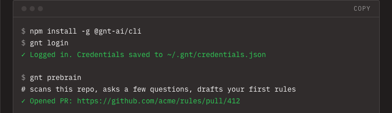

<div align="center">

# gnt.ai

gnt turns what your team knows into rules an AI agent has to check before it acts. Every rule
goes live through a real, human-approved pull request, not a dashboard click.

[](LICENSE) [](https://www.npmjs.com/package/@gnt-ai/cli) [](https://github.com/gnt-ai/gnt/actions/workflows/ci.yml)

</div>

Most teams find gnt after an agent already did something expensive, or wrong, or just
embarrassing, and nobody could say which rule should have caught it. gnt is what you set up
before that happens, not after.



## The 90-second loop

1. Someone on your team writes a rule (`gnt review`, or the web UI): "never refund over $500
   without a manager," "always CC legal on contract changes," whatever your org actually does.
2. gnt opens a real pull request against your own GitHub repo with that rule as a markdown file.
3. A human reviews and merges it. That merge is the approval. There's no separate "publish"
   step and no way for a rule to go live without a person merging a PR.
4. Any MCP-capable agent queries gnt live before acting, and gets back the merged, current rule:
   cited, versioned, and auditable back to the PR that approved it.

Not RAG. The point isn't better retrieval over a pile of docs. It's structured, validated,
cited rules that a human signed off on before an agent can rely on them.

## Quickstart: hosted

```
npm install -g @gnt-ai/cli
gnt login              # opens your browser once, stores an API key locally
gnt connect github      # connect the repo your rules PRs open against
gnt connect slack       # optional, connect a Slack workspace
gnt review              # review in-review rules, propose PRs or reject
```

Everything after `gnt login` runs from your terminal. The only browser tabs you'll see again
are one-off OAuth consent screens for connecting a new app, not a dashboard you live in. Give
your agent the MCP URL from `gnt keys create` and it can start querying rules.

## Quickstart: self-host

Everything below runs on your own infrastructure with your own API keys. Nothing calls
gnt.ai's hosted service.

```bash
git clone https://github.com/gnt-ai/gnt
cd gnt
./setup.sh
```

`setup.sh` copies both `.env` files, generates every secret it safely can (Fernet keys, the
shared secrets `apps/api` and `apps/store` use to talk to each other), then asks for the three
keys nothing can generate for you: Anthropic, Groq, ZeroEntropy, before building, migrating,
and booting the stack. Skip any of the three and it still comes up. You just add them before
relying on it (the script tells you exactly which ones are still placeholders when it finishes).

The API comes up on `http://localhost:8000`, with the MCP server mounted at
`http://localhost:8000/mcp`. It runs Postgres (pgvector), Redis, the store (rules storage +
approval gate), the API, and the background worker. apps/web (the marketing
site) isn't part of it, since self-hosting gnt means running the API and MCP server, not the
public website.

**Full walkthrough, env var reference, first-login/GitHub-connect steps, upgrade notes, and
troubleshooting: [`docs/self-hosting/README.md`](docs/self-hosting/README.md)**. Verified end
to end against a real `docker compose build/run/up`, including one real boot bug it found and
fixed along the way. Read it before your first real deploy, or if you'd rather run each step by
hand instead of `setup.sh`. `apps/api/DEPLOY.md` covers the
production-hardening step after that (the compose file connects everything as a single Postgres
superuser for a fast local start. DEPLOY.md documents the restricted-role setup, `gnt_app`/
`gnt_cron`/`gnt_admin` with row-level security, an actual production deployment should run
instead).

## What the license allows

FSL-1.1-Apache-2.0 (see `LICENSE`). In plain words:

- Read and audit every line, including the privacy/approval gate.
- Self-host on your own infrastructure with your own keys, for your own internal use.
- Modify it however you want.
- Contribute changes back, see `CONTRIBUTING.md` (DCO sign-off, no CLA).
- Two years after this repo goes public, the whole thing converts to Apache-2.0 and every
  restriction below disappears.

What it doesn't allow, until that conversion: running a competing hosted version of gnt as a
commercial product or service. See `NOTICE` for the separate trademark rule: a fork's public
service needs its own name, not "gnt" or the gnt.ai logo.

## Architecture

```
apps/web     Next.js marketing site + docs (no dashboard, the terminal is the product surface)
apps/api     FastAPI backend: git-native rules + GitHub webhook, skill-pack compiler, MCP
             server, Slack/Zendesk/Intercom/Notion/Linear connectors
apps/cli     gnt CLI, published as @gnt-ai/cli. login, connect, review (opens PRs), pull,
             status, keys. Fully terminal after login
apps/store   Rules storage and the approval gate: the internal HTTP API apps/api talks to for
             everything past the git-native rules seam (Postgres + pgvector, hybrid search)
```

Each app has its own README with setup/run instructions.

- **Stack**: Next.js 16 + Tailwind + Better Auth (web), FastAPI + Python 3.12 + SQLAlchemy 2.0
  async + Alembic + ARQ (api), Postgres + pgvector with row-level security, Claude for the
  rule-conflict check, ZeroEntropy for embeddings/reranking.
- **MCP**: the official Python SDK, mounted at `/mcp` inside the API. It's the one published,
  agent-facing surface.

## Development

See [`CONTRIBUTING.md`](CONTRIBUTING.md) for dev setup, lint/test commands, and how to open a PR.

## Links

- Self-host: `docs/self-hosting/README.md` for the full walkthrough, plus `apps/api/DEPLOY.md`
  for production hardening
- Security: `SECURITY.md`
- Code of conduct: `CODE_OF_CONDUCT.md`
- Questions or bugs: open a GitHub issue

## License

Copyright © 2026 gnt.ai. Licensed under [FSL-1.1-Apache-2.0](LICENSE), source-available today,
converts to Apache-2.0 two years after public release. See [`NOTICE`](NOTICE) for the trademark
terms.
